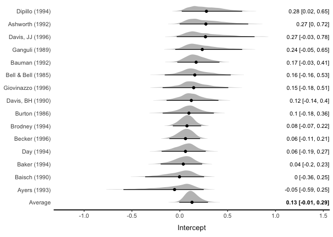
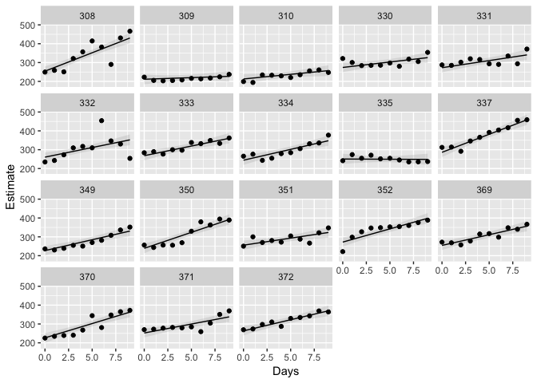
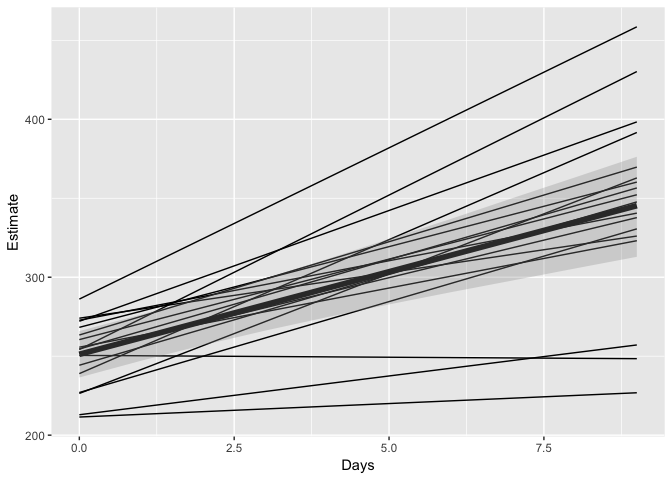
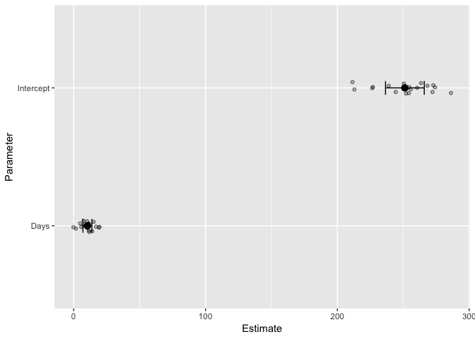

<!-- README.md is generated from README.Rmd. Please edit that file -->

# brmstools

brmstools is an R package [available on
GitHub](https://github.com/mvuorre/brmstools).

brmstools provides convenient plotting and post-processing functions for
brmsfit objects (bayesian regression models fitted with the [brms R
package](https://github.com/paul-buerkner/brms)).

brmstools is in beta version so will probably break down with some
inputs: [Suggestions for improvements and bug
reports](https://github.com/mvuorre/brmstools/issues) are welcomed. For
anything more complex I strongly recommend using brms’ native functions
instead (particularly its `marginal_effects()` and `hypothesis()`
methods. Combined with ggplot2 those functions will create any
visualization you can think of.)

# Install brmstools

Install brmstools from GitHub with
[devtools](https://cran.r-project.org/package=devtools):

``` r
# install.packages("devtools")
devtools::install_github("mvuorre/brmstools")
```

Loading brmstools also loads the brms package:

``` r
library(brmstools)
#> Loading required package: ggplot2
#> Loading required package: brms
#> Loading required package: Rcpp
#> Loading 'brms' package (version 2.3.4). Useful instructions
#> can be found by typing help('brms'). A more detailed introduction
#> to the package is available through vignette('brms_overview').
#> Run theme_set(theme_default()) to use the default bayesplot theme.
```

# Forest plots

Notably, `forest()` draws forest plots for meta-analytic and multilevel
models:

``` r
forest(fit_rem)
#> Picking joint bandwidth of 0.0227
```



# Panel plots

`panels()` draws panel plots:

``` r
panels(fit_ml, xvar = "Days")
```



# Spaghetti plots

`spaghetti()` draws spaghetti plots:

``` r
spaghetti(fit_ml, xvar = "Days")
```



# Coefficient plots

`coefplot()` draws coefficient plots:

``` r
coefplot(fit_ml)
```



# More information

Examples and instructions can be found at
<https://mvuorre.github.io/brmstools>.
